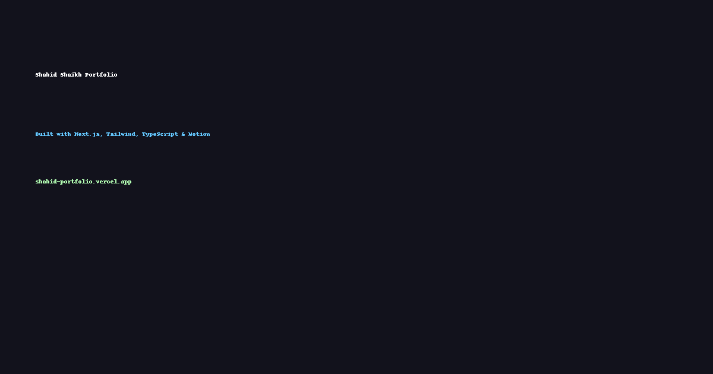

# Shahid Shaikh – Front-End Developer Portfolio


Live site 👉 [shahid-portfolio.vercel.app](https://shahid-portfolio.vercel.app)

---

## 🚀 Tech Stack

- [Next.js](https://nextjs.org/)
- [Tailwind CSS](https://tailwindcss.com/)
- [TypeScript](https://www.typescriptlang.org/)
- [Framer Motion](https://www.framer.com/motion/)

---

## 📂 Features

- ⚡ Animated hero section with smooth transitions
- 🧠 Scroll-based navigation + sticky footer
- 🌓 Dark / Light mode toggle with persistence
- 🛠️ Projects page with live previews and tech stack
- 🧾 Timeline of learning & growth

---

## 📷 Screenshots

| Home |
|------|
|  |

> (Add your own screenshots if needed)

---

## 🔗 Connect with Me

- [GitHub](https://github.com/dragonmon20)
- [LinkedIn](https://www.linkedin.com/in/shahidshaikhdev)
- 📧 1910shahidshaikh@gmail.com

---

## 📦 Setup Locally

```bash
# clone the repo
git clone https://github.com/dragonmon20/shahid-portfolio.git

# install dependencies
npm install

# run the dev server
npm run dev
```

---

## 📄 License

MIT License
